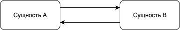

# Общительные сущности

**Цель лабораторной работы**: освоить навыки реализации систем на основе киберимунного подхода с применением брокера сообщений Mosquitto.

**Система включает в себя**: сущность А/B - типичный компонент системы, выполняющий задание по внутренней логике и способный общаться со сторонними сущностями.

Общая схема взаимодействия частей системы представлена на рисунке ниже.



Для реализации данной системы был использован брокер сообщений Mosquitto. **Брокер сообщений** - программная прослойка, предназначенная для обмена сообщений. Mosquitto функционирует по приципу **"Издатель - Подписчик"** (publish - subscribe):
- издатель (publisher) - сервис, который отправляет сообщение на определенные темы (топики) на сервер Mosquitto;
- подписчик (subscriber) - сервис, который подписывается на определенные темы (топики) и получает данные, отправленные издателем;
- брокер - получает сообщения от издателя и перенаправляет их подписчикам.

Для программной реализации на Python была использована библиотека **paho-mqtt**. Для инициализации клиента можно использовать следующий фрагмент:
```python 
import paho.mqtt.client as mqtt 
client = mqtt.Client(mqtt.CallbackAPIVersion.VERSION2, client_id='name')
client.connect('localhost', 1883, 60)
```

Получение и отправка сообщений при данном подходе осуществляется следующим образом:
```python
client.on_connect = on_connect 
client.on_message = on_message 

def on_message(client, user_data, msg) -> None:
        payload = json.loads(msg.payload.decode())
        #
        # работа с полезной нагрузкой сообщения
        #
        return 

def send_message(self, topic, message:str) -> None:
        self.client.publish(topic, message)
        return
```

## Задание на самостоятельную работу
1. Изучить исполняемый файл **example.py** с программной реализацией общения двух **сущностей A и B** (запустить, проанализровать информацию, выведенную в консоли).
2. Модифицировать политику безопасности системы, чтобы **сущность В** тоже могла отправлять сообщения **сущности А**. 
3. Зациклить общение сущностей: **сущность А** должна каждые 5 секунд отправлять сообщение **сущности В**, программа должна завершить свою работу при вводе в консоль программы сочетания клавиш **CTRL + C**.
4. Переконфигурировать журналирование происходящих событий при помощи модуля **logging**: события должны быть разделены на группы по статусу (Info, Warning, Error), а также результатом дурналирования кроме вывода в консоль должен быть журнал событий.
5. Добавить **сущность С**, которая будет принимать только сообщения с типом операции **change_mode**: система должна иметь флаг режима работы (например, режим работы 0 - используется классическая переработанная после задания 2 политика безопасности; режим работы 1 - все сообщения от сущности А запрещены политикой безопасности и т.д. по своему усмотрению). То есть сущность С должна уметь переконфигурировать политику безопасности по заранее подготовленным шаблонам.