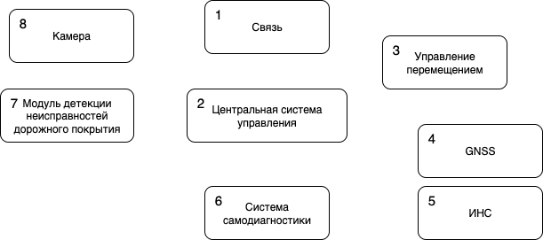

# Киберустойчивый БЛА "Сокол"

**Цель лабораторной работы**: освоить навыки проектирования сложных систем с применением киберимунного подхода.

## Общее описание БЛА "Сокол"
БЛА "Сокол" направлен на мониторинг состояния дорожного покрытия автомагистралей.

**Базовый сценарий работы БЛА (БЛА уже в воздухе и имеет маршрут движения)**:
1. БЛА получает пакет данных телеметрии.
2. ЦСУ анализирует полученный пакет для выявления аномалий позиционирования.
3. ЦСУ принимает решение о целесообразности продолжения полетного задания (при отрицательном решении - посадка БЛА и выход из цикла выполнения полетного задания).
4. Камера получает изображение и передает его в модуль детекции неисправностей дорожного движения.
5. Система самодиагностики собирает коды состояния с каждой подсистемы, анализирует их и передает в ЦСУ решение.
6. ЦСУ принимает решение о целесообразности продолжения полетного задания (при отрицательном решении - посадка БЛА и выход из цикла выполнения полетного задания).
7. Возврат к шагу № 1.

Общая архитектура БЛА представлена на рисунке ниже.

| Сущность | Описание сущности |
|----------|-------------------|
| 1. Связь | Отвечает за получение телеметрической информации от БЛА|
| 2. Центральная система управления (ЦСУ) | Отвечает за общую организацию управления подсистемами, а также за ведения журнала происходящих событий |
| 3. Управление перемещением | Отвечает за расчет данных о перемещении (азимут к целевой точке, расстояние до нее), а также за отследиванием процесса перемещения и достижения целевой точки |
| 4. GNSS | Отвечает за получение данных с глобальной навигационной спутников системы |
| 5. ИНС | Отвечает за получение навигационных данных на основе данных об инерциальном движении БЛА |
| 6. Система самодиагностики | Отвечает за сбор статусов состояния с каждого из подсистем |
| 7. Модуль детекции неисправностей дорожного покрытия | Отвечает за обработку изображений, полученных с камеры БЛА, на предмет наличия повреждений дорожного покрытия |
| 8. Камера | Отвечает за получения изображений дорожного покрытия и их передачу на модуль детекции неисправностей |

**Цели безопасности**:
1. БЛА выполняет полетное задание в авторизованном районе.
2. Данные о записанных ЦСУ нарушениях целостности дорожного полотна в любой момент времени корректны.

**Предположения безопасности**:
1. Полетное задание, получаемое БЛА - корректно.
2. Система управления перемещением - благонадежна.

## Задание на самостоятельную работу
1. Расширить архитектуру БЛА "Сокол" для упрощения защиты системы.
2. Составить итоговую политику архитектуры БЛА "Сокол" с имеющимися:
    - пометками о целостности сущности (низкоцелостный, выосокоцелостный, повышающая целостность);
    - ориентированными потоками низко-/высокоцелостных данных;
    - качественными оценками сущностей (по сложности и размеру).
3. Сформировать сценарий взаимодействия получившихся сущностей при помощи [PlantUML-диаграммы](https://editor.plantuml.com/).
4. Сформировать группу негативных сценариев (2-3 шт.) для получившейся архитектуры при помощи [PlantUML-диаграммы](https://editor.plantuml.com/).
5. Провести анализ векторов получившихся атак и эффекта от их исполнения.
6. Сформировать DrawIO-файл в качестве отчета о выполненной работе.